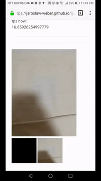

# gobof.js

6dof tracking inside the browser!

open firefox,
go to:
about:config
then set
network.websocket.allowInsecureFromHTTPS
flag to true.

Then go to:

https://jaroslaw-weber.github.io/gobofjs/

# how to use

- set fps (default to 60)
- input websocket server and click update button
- click start tracking

# libraries

- opencv wasm build by https://github.com/huningxin
- opencv is under BSD license; you can find more about it here: https://github.com/opencv/opencv
